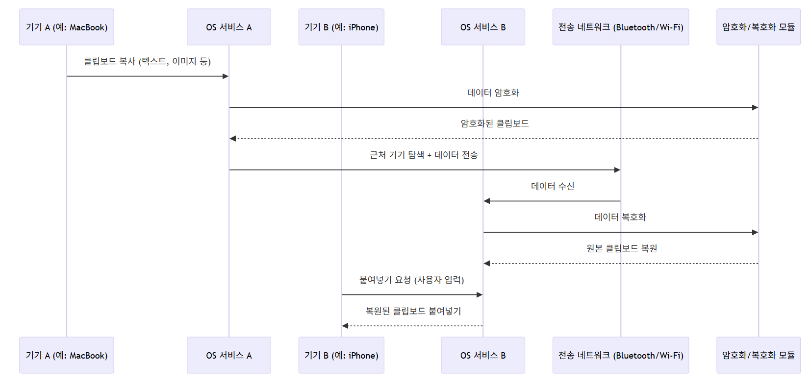

# jiwon_uni

# 🖥️ Universal Clipboard Simulation – 기기 간 클립보드 동기화 시스템

## 📌 프로젝트 개요

Universal Clipboard는 애플 생태계에서 제공하는 기능으로,  
**서로 다른 기기 간에 클립보드(복사한 내용)를 실시간으로 공유**할 수 있도록 지원합니다.  
예: MacBook에서 복사한 텍스트를 iPhone에서 바로 붙여넣을 수 있음.

이 프로젝트는 해당 시스템을 간단한 Python 코드로 시뮬레이션하여,  
**시퀀스 다이어그램 기반 시스템 분석 → 코드 구현 → 모듈 구조 평가**의 과정을 수행합니다.


---

## 🎯 사용 시나리오

1. 사용자가 MacBook에서 어떤 텍스트를 복사합니다.
2. 운영체제가 클립보드 변경을 감지하고 암호화합니다.
3. 근처의 연결된 iPhone을 Bluetooth/Wi-Fi로 탐색합니다.
4. 기기 간 인증 후 암호화된 데이터를 전송합니다.
5. 사용자가 iPhone에서 붙여넣기를 누르면 복호화하여 적용합니다.

---

## 📊 시퀀스 다이어그램



---

## 💻 샘플 코드 (일부 발췌)

```python
class Clipboard:
    def __init__(self):
        self.data = ""

    def copy(self, content):
        print("[Device A] 복사된 데이터:", content)
        self.data = content

    def paste(self):
        print("[Device B] 붙여넣기 결과:", self.data)
        return self.data


````

→ 전체 코드는 [`main.py`](./main.py)를 참고

---

## 📈 모듈 평가 요약

| 항목  | 설명                                                                |
| --- | ----------------------------------------------------------------- |
| 응집도 | `Clipboard`, `Crypto`, `NetworkSimulator`는 각각 하나의 책임만 수행하여 응집도 높음 |
| 결합도 | 모듈 간 직접 참조 없이 데이터만 주고받는 구조로 결합도 낮음                                |
| 확장성 | 암호화 알고리즘이나 전송 방식 교체 시 내부 변경 없이 모듈만 대체 가능                          |

---

## 📌 실제 시스템과의 비교

| 항목     | 실제 Universal Clipboard        | 본 시뮬레이션             |
| ------ | ----------------------------- | ------------------- |
| 네트워크   | Bluetooth LE + Wi-Fi P2P      | 단순화된 가상 Network 클래스 |
| 보안     | Apple ID 인증 + E2E 암호화         | Base64 모의 암호화       |
| 기기 탐색  | Bonjour 및 proximity detection | 네트워크 객체 내부 시뮬레이션    |
| 동기화 방식 | 사용자 붙여넣기 시 pull               | 직접 전송 트리거           |

→ 실제 시스템은 더 복잡한 인증·보안·전송 처리를 포함하나,
본 프로젝트는 핵심 흐름을 모델링하여 구조적 개념을 이해하는 데 중점을 두었습니다.

---

## 🔧 개선 가능성 및 한계

* 현재는 단일 사용자 시나리오만 처리 가능 (멀티 유저/충돌 관리 없음)
* 실제 시스템은 중복 전송 방지, 에러 복구, 지연 재시도 등의 기능 포함
* WebSocket 기반 실시간 처리 또는 클라우드 클립보드 서버와의 연동도 확장 가능

---

## 🔄 동작 흐름 요약

1. 사용자가 복사(Copy)
2. 운영체제가 복사 이벤트 감지
3. 클립보드 데이터 암호화 수행
4. 근거리 기기 탐색
5. 연결된 기기에 데이터 전송
6. 사용자가 붙여넣기 요청
7. 수신 기기에서 복호화 후 클립보드 반영

---

## 📁 파일 구성

| 파일명         | 설명                                    |
| ----------- | ------------------------------------- |
| `main.py`   | Python 코드 – Universal Clipboard 시뮬레이션 |
| `다이어그램.png` | Mermaid 시퀀스 다이어그램 이미지                 |
| `README.md` | 전체 프로젝트 설명 및 결과물 문서                   |

---


